# My LAMP Setup on Ubuntu 22.04

## Firewall

```
sudo ufw enable
```

```
sudo ufw allow 22
```

## Apache

```
sudo apt install apache2
```

```
sudo ufw allow Apache
```

```
sudo ufw allow 'Apache Full'
```

```
sudo ufw allow 'Apache Secure'
```

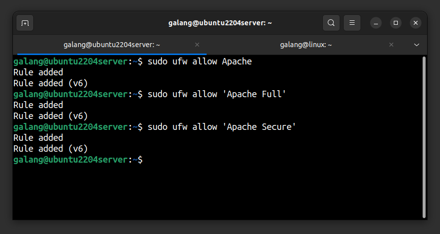

## MariaDB

```
sudo apt install mariadb-server mariadb-client
```

```
sudo mysql_secure_installation
```

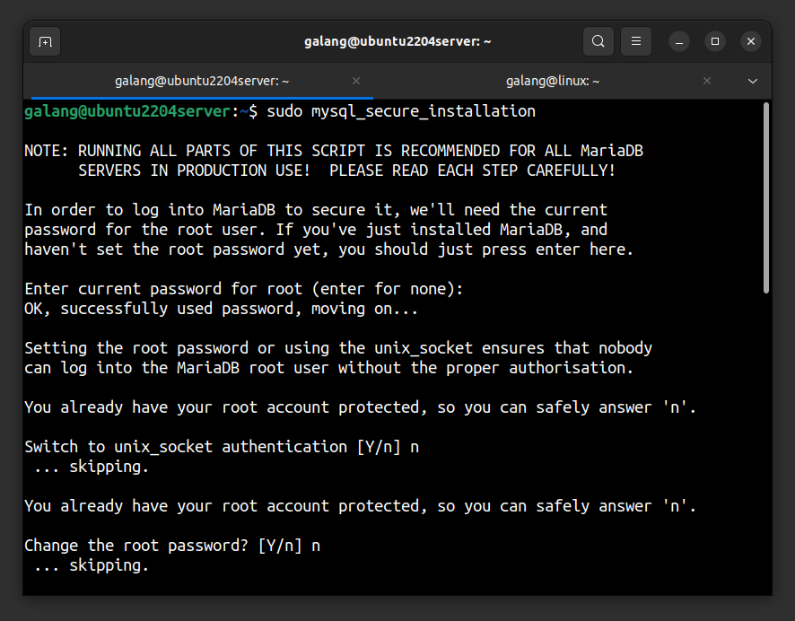
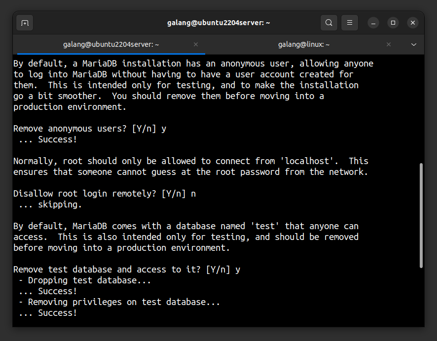


```
sudo mysql
```

```
CREATE USER 'user'@'%' IDENTIFIED BY 'password';
```

```
GRANT ALL PRIVILEGES ON *.* TO 'user'@'%';
```

```
FLUSH PRIVILEGES;
```

```
EXIT
```

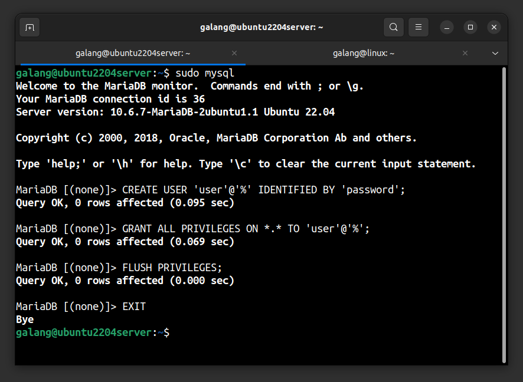

### Enable MariaDB Remote Access

```
sudo ufw allow 3306
```

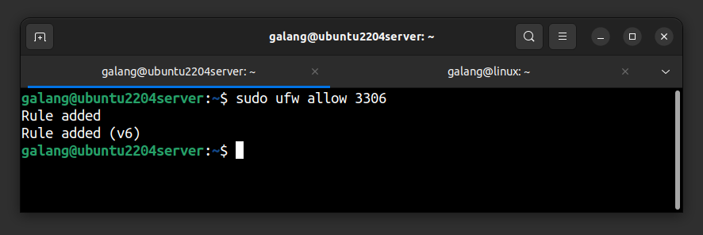

```
sudo vim /etc/mysql/mariadb.conf.d/50-server.cnf
```

- From this
  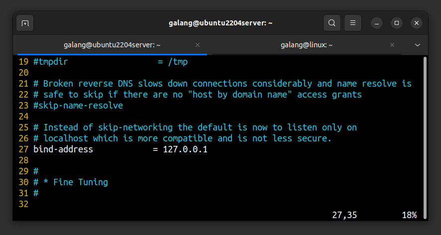
- To this
  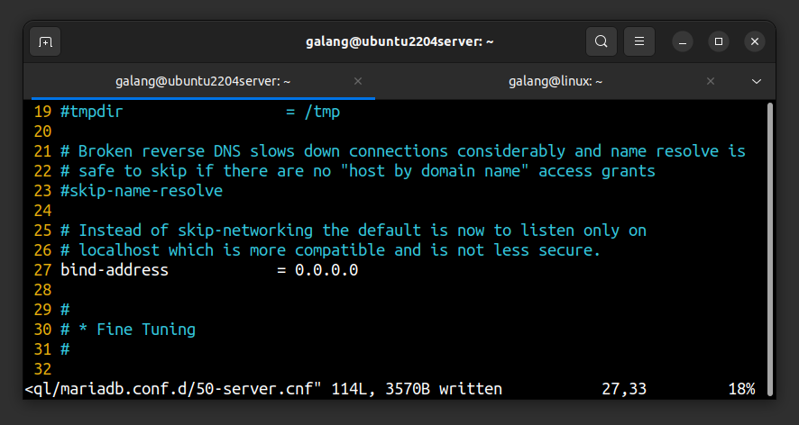

- Restart MariaDB

```
sudo systemctl restart mariadb.service
```

## PHP

```
sudo apt install php libapache2-mod-php php-mysql
```

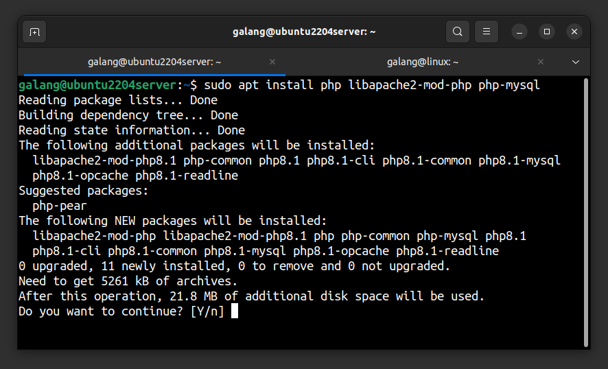
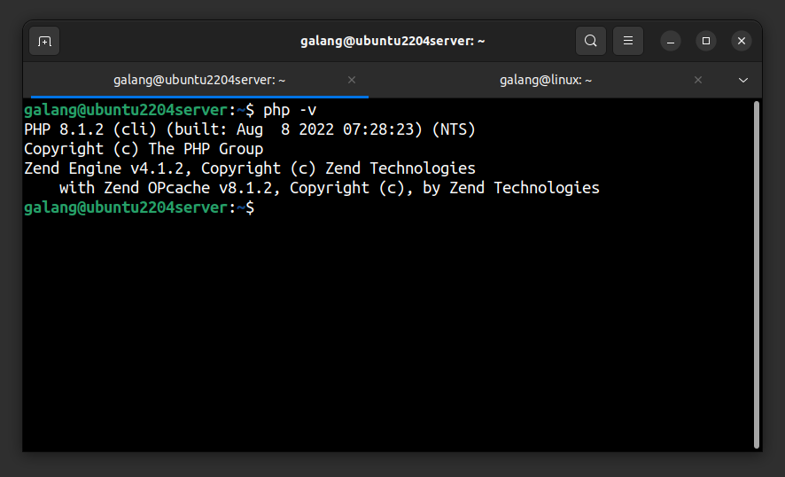

## phpMyAdmin

```
sudo apt install phpmyadmin
```

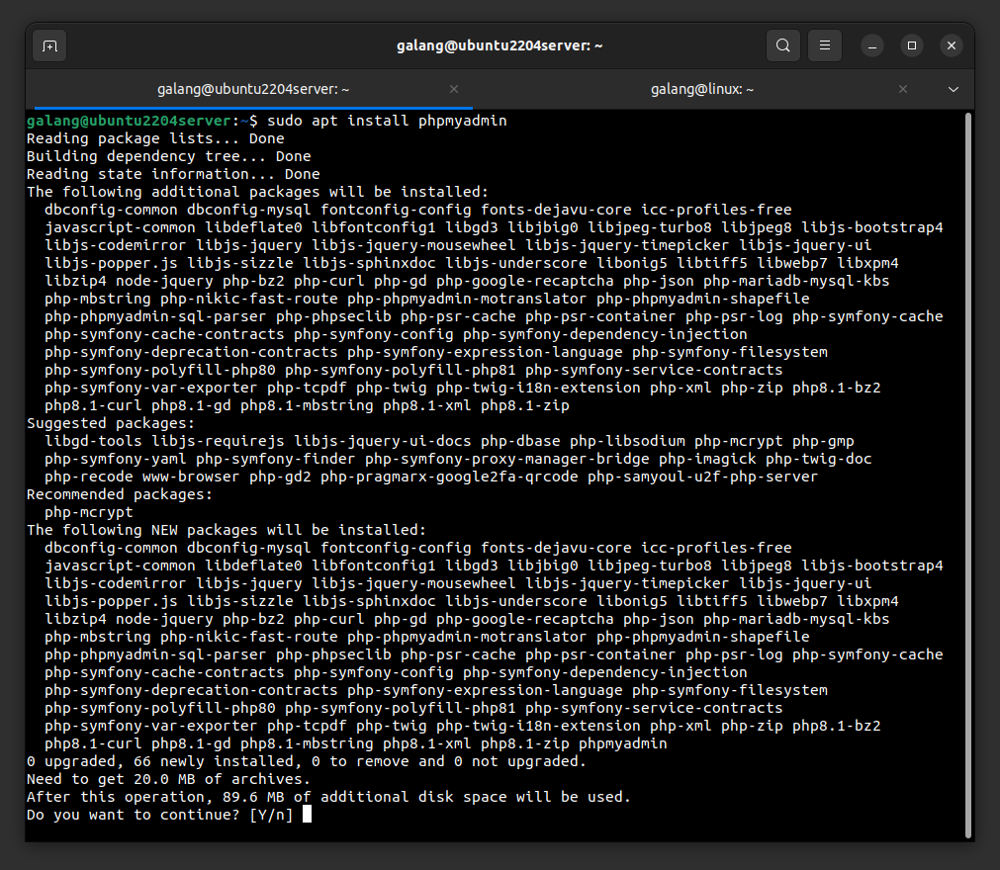

- Choose apache2
  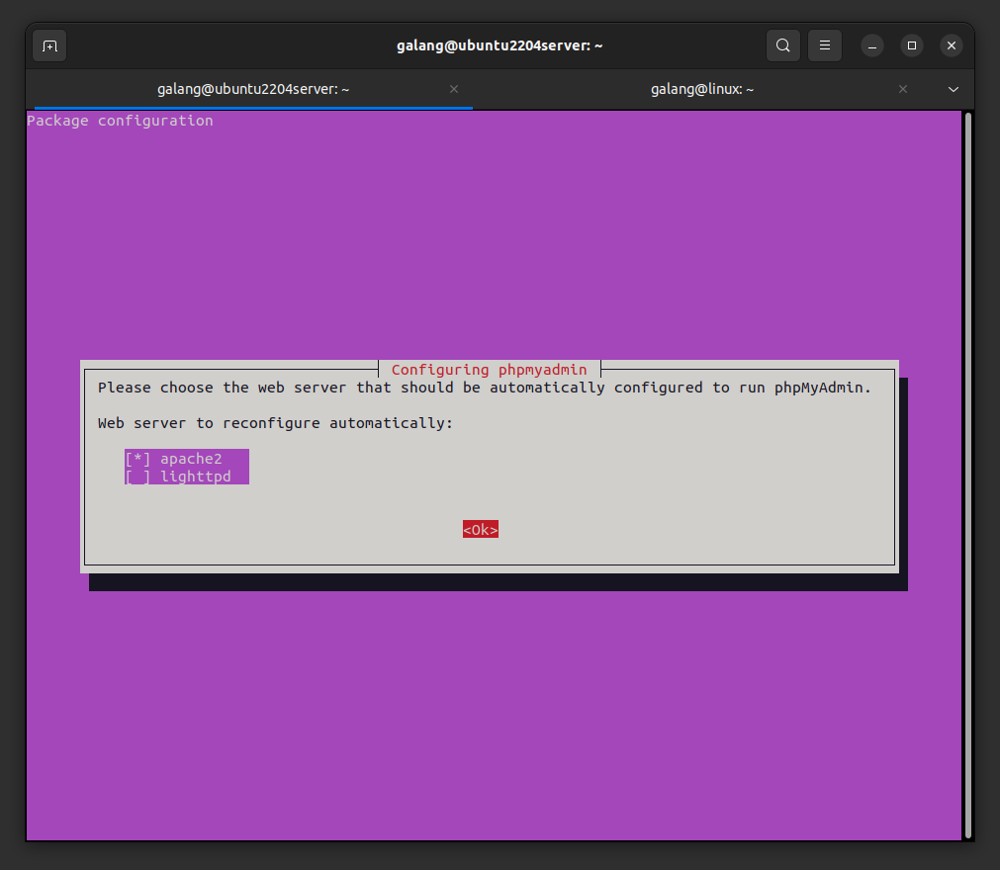
- Choose yes
  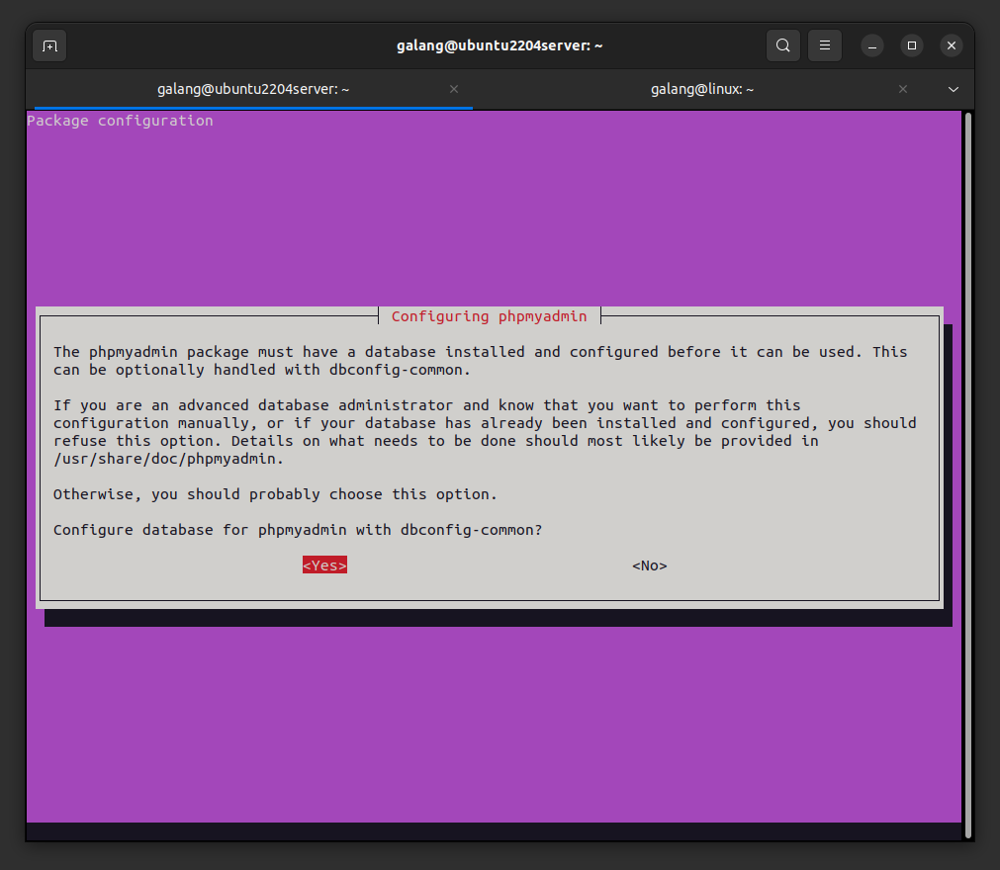
- Input password for phpMyAdmin
  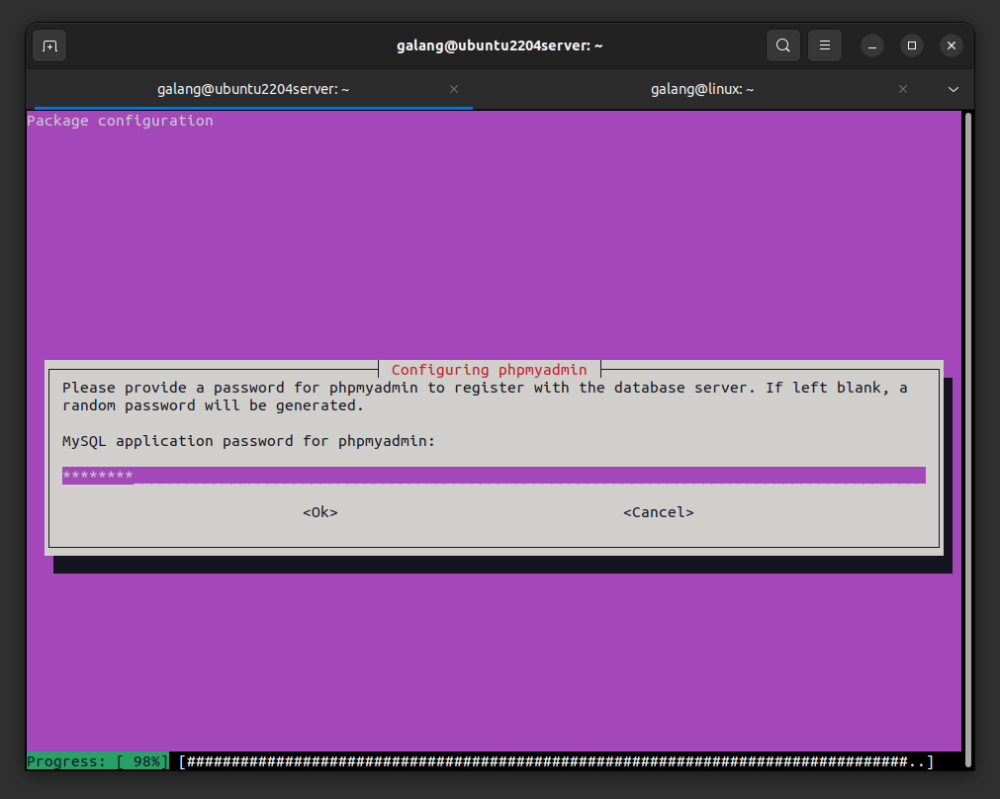
  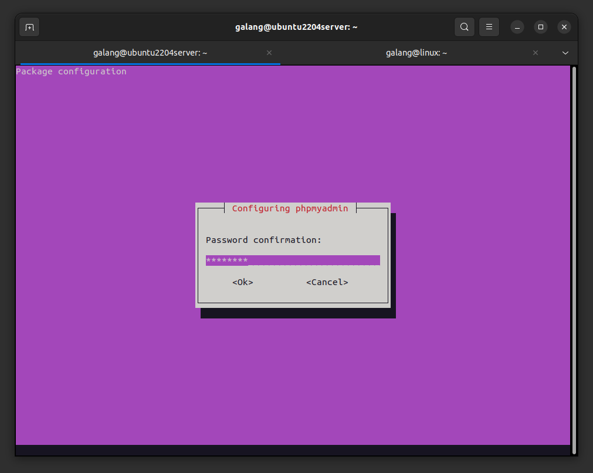
- Open phpMyAdmin in browser
  
