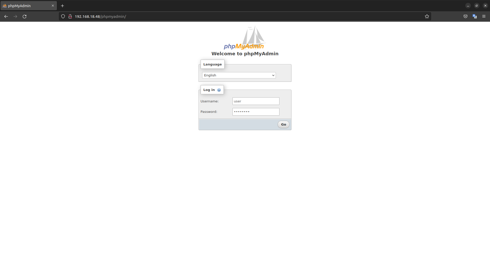
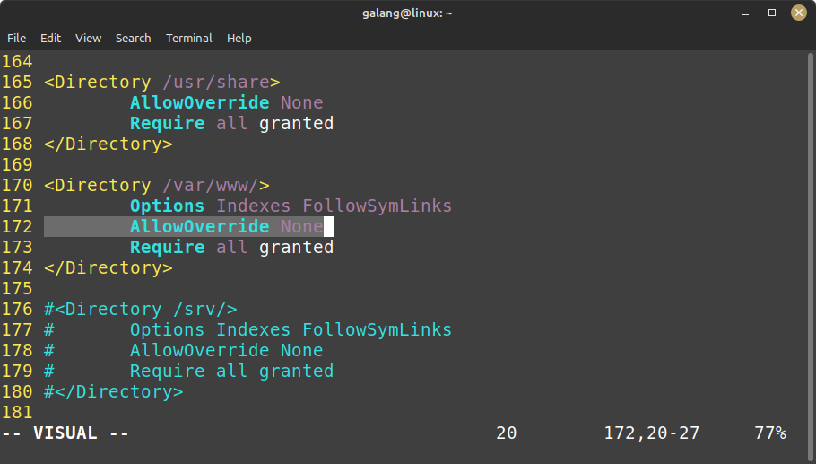
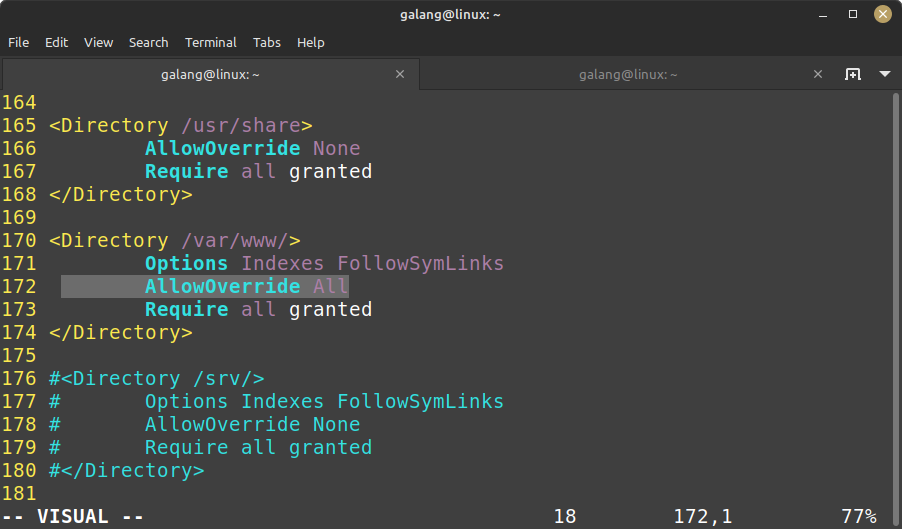
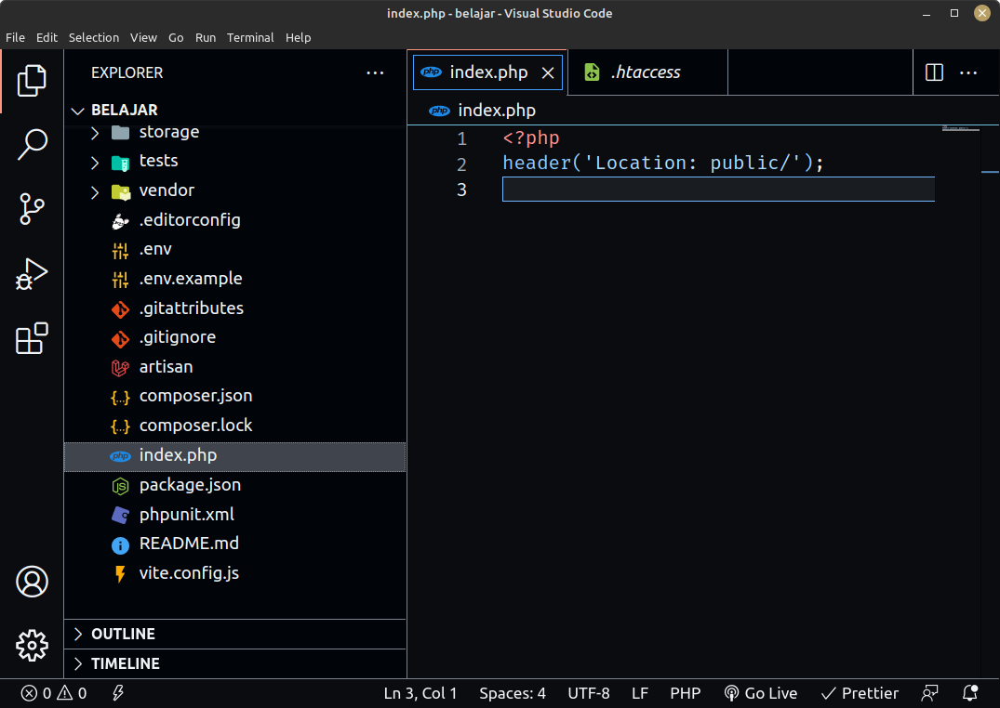

# Tested in Ubuntu 22.04

## Firewall

```
sudo ufw enable
```

```
sudo ufw allow 22
```

## Apache

```
sudo apt install apache2
```

```
sudo ufw allow Apache
```

```
sudo ufw allow 'Apache Full'
```

```
sudo ufw allow 'Apache Secure'
```


## MariaDB

```
sudo apt install mariadb-server mariadb-client
```

```
sudo mysql_secure_installation
```


```
sudo mysql
```

```
CREATE USER 'user'@'%' IDENTIFIED BY 'password';
```

```
GRANT ALL PRIVILEGES ON *.* TO 'user'@'%';
```

```
FLUSH PRIVILEGES;
```

```
EXIT
```


### Enable MariaDB Remote Access

```
sudo ufw allow 3306
```


```
sudo vim /etc/mysql/mariadb.conf.d/50-server.cnf
```

- From this
  
- To this
  

- Restart MariaDB

```
sudo systemctl restart mariadb.service
```

## PHP

```
sudo apt install php7.4 libapache2-mod-php7.4 php7.4-bcmath php7.4-curl php7.4-json php7.4-mbstring php7.4-mysql php7.4-tokenizer php7.4-xml php7.4-zip php7.4-cli php7.4-fpm
```


## phpMyAdmin

```
sudo apt install phpmyadmin
```


- Choose apache2
  
- Choose yes
  
- Input password for phpMyAdmin
  
  
- Open phpMyAdmin in browser
  

# Setup
```
sudo chown -R $USER:$USER /var/www/html
```
```
sudo chmod -R 755 /var/www/html
```

# CodeIgniter 3 Problem

```
sudo vim /etc/apache2/apache2.conf
```

- Change this
  
- To this
  

```
sudo systemctl restart apache2.service
```

```
sudo a2enmod rewrite
```

```
sudo systemctl restart apache2.service
```

# Laravel 9 Problem

```
sudo chmod 777 /var/www/html/laravel/storage
```

```
vim /var/www/html/laravel/index.php
```


